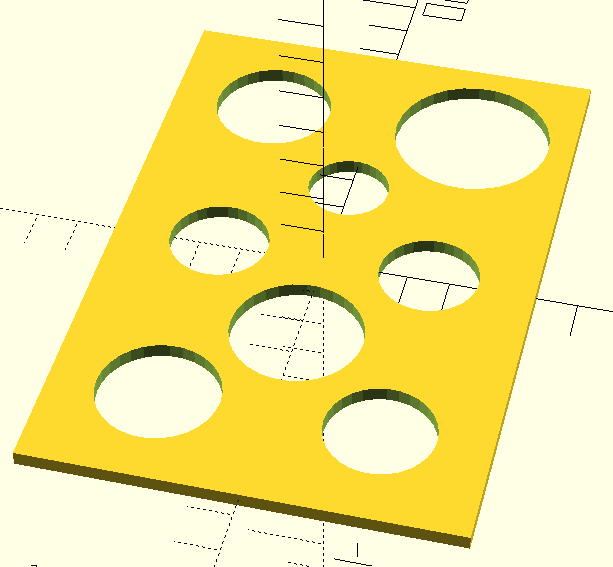

# Coin Plate For Photo Frame
Open CoinPlate.scad in [OpenSCAD](https://openscad.org/downloads.html).
Press F5 to render.
Go to file/export to save a .stl file and 3D print.
You  can use various people [online](https://www.google.com/search?q=local+3d+printing+services+near+me) to print this for you.
Paste the [text](https://raw.githubusercontent.com/morganelectronics/coinplate/refs/heads/main/CoinPlate.scad) into your favourite [AI tool](https://claude.ai/) to customise to your own coins / photo frame. 

